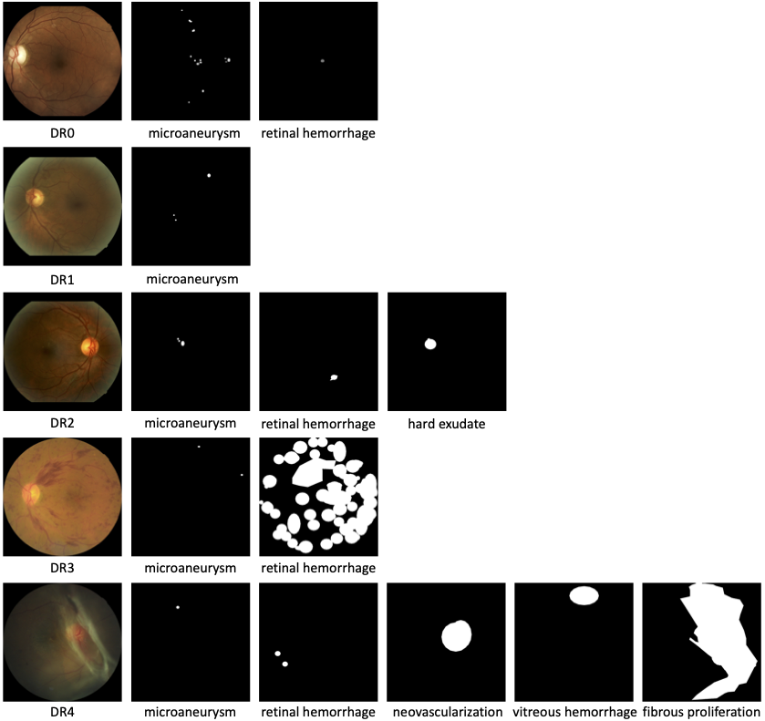

# Retinal-Lesions

Retinal-Lesions is a novel color fundus image dataset for evaluating retinal lesion segmentation, classification and diabetic retinopathy (DR) grading. See our arxiv paper [Learn to Segment Retinal Lesions and Beyond](https://arxiv.org/abs/1912.11619) for details.

## Highlights

+ Over 1.5K images selected from the public [Kaggle DR Detection dataset](https://www.kaggle.com/c/diabetic-retinopathy-detection);
+ Five DR grades (DR0 / DR1 / DR2 / DR3 / DR4), re-labeled by a panel of 45 experienced ophthalmologists;
+ Eight retinal lesion classes, including *microaneurysm*, *intraretinal hemorrhage*, *hard exudate*, *cotton-wool spot*, *vitreous hemorrhage*, *preretinal hemorrhage*, *neovascularization* and *fibrous proliferation*;
+ Over 34K expert-labeled pixel-level lesion segments;
+ Multi-task, i.e., *lesion segmentation*, *lesion classification*, and *DR grading*.

### Comparison to existing public datasets

| Dataset         | Images  | Annotations |
| :--             | --:     | :--   |
| [Kaggle](https://www.kaggle.com/c/diabetic-retinopathy-detection)          | 88,702  | + Image-level DR grades |
| [Messidor1](http://www.adcis.net/en/third-party/messidor/)       | 1,200   | + Image-level DR grades (no DR4) |
| [IDRiD](https://idrid.grand-challenge.org/Data/)  | 597     | + 516 images with image-level DR grades   + 81 images with pixel-level lesion labels (4 lesion classes) |
| **Retinal-Lesions** | 1,593   | + Image-level DR grades (DR0: 166, DR1: 337, DR2: 929, DR3: 99, DR4: 62)   + Pixel-level lesion labels (8 lesion classes) |

## Download

Data is freely available upon request. Please submit your request via [Google Form](https://docs.google.com/forms/d/1qQdfxjK6igFopdAVu4Eagc-fRRYhK2Tja0fuyRXi8Z8)

*Note*: Each image has been cropped by a [preprocessing algorithm](https://doi.org/10.1007/978-3-030-05710-7_42) to a square image containing only the field-of-view, and resized to 896x896. There are few lesion annotations not complied to the [American Academy of Ophthalmology (AAO) guidelines for DR grading](https://www.aao.org/preferred-practice-pattern/diabetic-retinopathy-ppp-updated-2017). While excluded from experiments, they are included in the provided segmentation masks, with a specific gray value (127). 

+ 2020-03-23: [Auto-localization of the optic disc and the fovea](od_fovea_autoloc.txt) by spatially constrained Faster R-CNN, Yang et al., [Joint Localization of Optic Disc and Fovea in Ultra-widefield Fundus Images](https://link.springer.com/chapter/10.1007/978-3-030-32692-0_52), MLMI@MICCAI 2019

## Citation

If you use the Retinal-Lesions dataset, please cite the following paper:

@article{wei2019lesion,  
  title={Learn to segment retinal lesions and beyond},  
  author={Qijie Wei and Xirong Li and Weihong Yu and Xiao Zhang and Yongpeng Zhang and Bojie Hu and Bin Mo and Di Gong and Ning Chen and Dayong Ding and Youxin Chen},  
  journal={arXiv preprint arXiv:1912.11619},  
  year={2019}  
}
